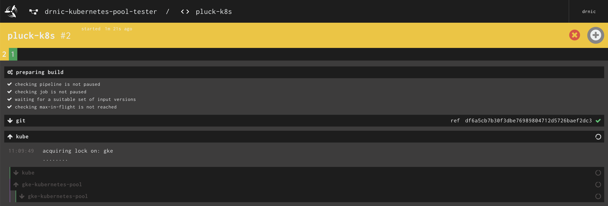
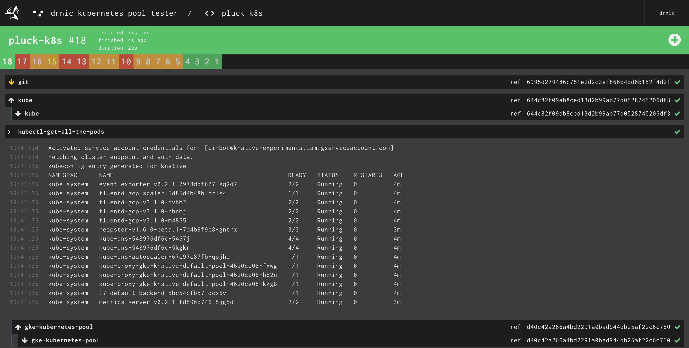

# Concourse Pool of temporarily available Kubernetes clusters

Acquiring a GKE cluster...

Successfully authenticating to GCP, getting the `kubectl` context from GKE, and using `kubectl` against the GKE cluster...

